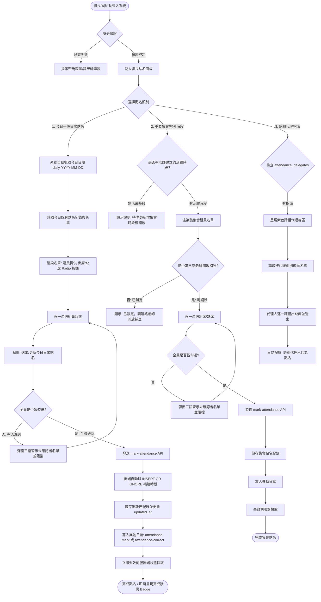

# 點名管理系統架構與跨專案移植指南 v2 (Roll Call & Attendance System Blueprint v2)

> **版本**：v2.50+（最新完整實務驗證版，含缺席排行榜與活動明細彈窗）
> **適用場景**：課堂點名、專案分組出勤考核、跨國籍外籍生教學、幹部自主點名、三端缺席排行榜、防弊與彈性補登
> **技術相容**：全端通用（Node.js / Express / Next.js / Cloudflare Workers / Python FastAPI / SQLite / D1 / PostgreSQL / MySQL）

---

## 目錄 (Table of Contents)

1. [系統概覽與核心理念 (Overview &amp; Philosophy)](#1-系統概覽與核心理念-overview--philosophy)
2. [角色權限與身分認證閉環 (Authentication &amp; Authorization)](#2-角色權限與身分認證閉環-authentication--authorization)
3. [完整業務流程與狀態機 (Business Logic &amp; State Machine)](#3-完整業務流程與狀態機-business-logic--state-machine)
4. [資料庫綱要設計 (Database Schema &amp; Indexes)](#4-資料庫綱要設計-database-schema--indexes)
5. [後端 API 規格與核心演算法 (Backend API &amp; Core Logic)](#5-後端-api-規格與核心演算法-backend-api--core-logic)
6. [前端 UI/UX 設計模式與防呆防弊 (Frontend UI/UX &amp; Anti-Cheat)](#6-前端-uiux-設計模式與防呆防弊-frontend-uiux--anti-cheat)
7. [三端缺席排行榜與缺席明細彈窗 (Multi-Level Leaderboard &amp; Modal)](#7-三端缺席排行榜與缺席明細彈窗-multi-level-leaderboard--modal)
8. [教師端全方位點名監控儀表板 (Teacher Dashboard)](#8-教師端全方位點名監控儀表板-teacher-dashboard)
9. [高併發讀寫防護與快取策略 (Performance &amp; Concurrency Optimization)](#9-高併發讀寫防護與快取策略-performance--concurrency-optimization)
10. [端到端參考實作代碼 (End-to-End Reference Code)](#10-端到端參考實作代碼-end-to-end-reference-code)
11. [跨專案逐步移植指南與檢查清單 (Migration Checklist)](#11-跨專案逐步移植指南與檢查清單-migration-checklist)

---

## 1. 系統概覽與核心理念 (Overview & Philosophy)

在傳統教學或專案管理系統中，點名往往存在兩難：**「若由老師親自逐一點名，極度耗費課堂時間」**；**「若交由學生幹部自主點名，又常流於形式、虛報全員到齊、或因幹部缺席而停擺」**。

本點名管理系統歷經多學期大規模課堂與實務驗證，建立了一套兼顧**「極低維護成本」**、**「高信賴度防弊」**與**「前中後台透明出勤監控」**的自主點名體系。

### 1.1 教學與管理現實現況 vs 本系統解決方案

| 現實現況 / 痛點 (Pain Points)                                                                    | 本系統解決方案 (Solutions)                                                                                                                                         | 實務效益與防弊設計 (Benefits)                  |
| :----------------------------------------------------------------------------------------------- | :----------------------------------------------------------------------------------------------------------------------------------------------------------------- | :--------------------------------------------- |
| **痛點 1：日常點名需老師預先開時段**每次上課老師都要先開電腦建時段，遺忘或造成操作負擔。   | **日常點名零設定（免預建時段）**系統自動以當日日期識別`daily-YYYY-MM-DD`，幹部登入直接點名，送出時系統自動延遲持久化。                                           | 老師零負擔，組長開課即點，流暢無阻。           |
| **痛點 2：成果展示需額外點名**系週會、專案成果展或多次集會需獨立記錄。                     | **成果展示與額外時段手動建立**老師可在後台自訂日期、節次與名稱（如「期末專題評審」），組長於前台專區額外點名。                                               | 彈性支援單日多時段與特殊考核活動。             |
| **痛點 3：組長虛報「全員到齊」捷徑**提供一鍵全選按鈕，組長常不看名單隨手按送出。           | **嚴格禁用「一鍵到齊」按鈕**強制逐一為每位組員單獨勾選單選鈕（出席／缺席）。送出前若有任一人漏選，立即阻擋並彈窗告警。                                       | 杜絕草率勾選，迫使幹部確實清點人數。           |
| **痛點 4：下課後串通偷改出缺席紀錄**幹部因人情壓力私下將缺席同學改為出席。                 | **當日自由修正，跨日強制鎖定**當日課堂內允許彈性修正（支援遲到補改）；一旦午夜過渡至隔日，自動強制鎖定為唯讀。                                               | 兼顧當天容錯修正與隔日防弊安全性。             |
| **痛點 5：組長與副組長均缺席癱瘓點名**該組幹部皆未到，導致全組無人有權限點名。             | **跨組代理點名機制 (Delegation)**後台即時警示幹部缺席組別，老師可一鍵指派鄰近組長／副組長跨組代理點名，日誌註記代理人。                                            | 消除單點故障，避免組別陷入無人點名窘境。       |
| **痛點 6：公假或正當事後補登需求**學生事後補請假需開放修正，但不能永久開放。               | **時效性精準補登解鎖 (Granular Unlock)**老師可針對「指定組別」或「全班」，開放補登並強制設定「截止時間 Deadline」（逾時自動復鎖）。                                | 權限收放精確，無須人工手動關閉。               |
| **痛點 7：遲到補點名引發爭議**學生宣稱組長記錯時間，無法釐清責任。                         | **雙時間戳與細緻稽核日誌**分別記錄首次點名時間 (`createdAt`) 與最後修正時間 (`updatedAt`)，日誌詳細記錄「由缺席改為出席」。                              | 責任釐清完全透明，後台懸停即見時間戳。         |
| **痛點 8：缺席次數缺乏透明可視化與明細佐證**僅顯示次數，學生對被記缺席之日期與活動有疑義。 | **三端缺席排行榜 + 缺席活動明細彈窗**一般前台、組長後台、老師後台同步提供排行榜，點擊次數 Badge 立即跳出互動彈窗，清晰羅列每一次缺席日期、活動名稱與點名人。 | 學生自我警惕、幹部掌握組員狀況、老師輔導有據。 |
| **痛點 9：外籍生操作門檻與忘記密碼**介面語文不易理解造成誤按，或幹部忘記密碼。             | **中／英語對照 + 老師協助重設密碼**前台與組長後台二語標記；老師可於後台直接協助組長重設密碼或還原為預設學號。                                                | 外籍學生無障礙操作，幹部密碼快速救援。         |

---

## 2. 角色權限與身分認證閉環 (Authentication & Authorization)

點名權限的嚴密性仰賴健全的身分認證。若另一專案無適當的身分驗證機制，點名防弊將出現漏洞。

### 2.1 角色職責矩陣

| 角色 (Role)                     | 識別方式 (Identity)                 | 點名管理權限 (Permissions)                                                                                                                                                                      | 密碼機制 (Password)                      |
| :------------------------------ | :---------------------------------- | :---------------------------------------------------------------------------------------------------------------------------------------------------------------------------------------------- | :--------------------------------------- |
| **授課教師 (Teacher)**    | 角色為`teacher`                   | • 建立/編輯/刪除重要集會點名時段• 開放/關閉補登權限（含截止時間）• 指派/撤銷跨組代理點名• 即時檢視未完成點名組別與組員• 查看缺席紀錄、全班排行榜與缺席明細• 協助組長/副組長修改或重設密碼 | 系統管理員密碼（雜湊儲存）               |
| **組長 (Group Leader)**   | `student.is_leader === true`      | • 執行本組當日日常點名與重要集會點名• 於老師解鎖時執行歷史時段補登• 檢視本組專屬缺席排行榜與點開明細• 若獲指派，可代理他組點名• 自行修改個人登入密碼                                       | 預設為學號，登入後可自訂新密碼 (SHA-256) |
| **副組長 (Vice Leader)**  | `student.is_vice === true`        | 與組長享有一致之點名權限（互為備援）                                                                                                                                                            | 預設為學號，登入後可自訂新密碼 (SHA-256) |
| **跨組代理人 (Delegate)** | 經由`attendance_delegates` 表授權 | 於指定時段內代理被指派組別進行點名                                                                                                                                                              | 依原組長/副組長身分登入                  |
| **一般組員 (Member)**     | 一般學生                            | • 檢視個人組別與出缺席歷史狀態• 於前台查看公開缺席排行榜與明細（個資遮罩）                                                                                                                    | 預設為學號（若有開放學生登入）           |

### 2.2 組長與副組長密碼安全機制

1. **初始預設密碼**：學生名冊匯入後，組長與副組長預設登入密碼為其**「學號」**。
2. **幹部自主變更密碼**：組長/副組長登入其後台後，可輸入「目前密碼」與「新密碼（至少 4 碼）」完成修改，密碼經過 SHA-256 雜湊儲存於 `students.password_hash`。
3. **老師緊急重設支援**：當組長忘記密碼時，老師在後台的「組長與副組長列表」可直接：
   - 點選「✏️ 設定新密碼」為該幹部指派新密碼。
   - 點選「🔄 重設為學號」一鍵清空 `password_hash`，恢復為預設學號登入。

---

## 3. 完整業務流程與狀態機 (Business Logic & State Machine)

### 3.1 點名作業完整流程圖 (Mermaid Workflow)



---

## 4. 資料庫綱要設計 (Database Schema & Indexes)

本系統使用關聯式綱要設計，各表以課程/班級鍵 (`course_id`) 進行多租戶隔離，適用於 SQLite、Cloudflare D1、MySQL 或 PostgreSQL。

```sql
-- ============================================================
-- 1. 學生資料表擴充欄位（支援幹部權限與自訂密碼）
-- ============================================================
ALTER TABLE students ADD COLUMN is_leader INTEGER NOT NULL DEFAULT 0;
ALTER TABLE students ADD COLUMN is_vice INTEGER NOT NULL DEFAULT 0;
ALTER TABLE students ADD COLUMN password_hash TEXT NOT NULL DEFAULT ''; -- SHA-256 雜湊，空值表示使用預設學號

CREATE INDEX IF NOT EXISTS idx_students_group ON students(course_id, group_id);

-- ============================================================
-- 2. 點名時段表 (attendance_sessions)
-- ============================================================
CREATE TABLE IF NOT EXISTS attendance_sessions (
  id          TEXT NOT NULL,               -- 唯一鍵，例：'daily-2026-09-22' 或自建 ID
  course_id   TEXT NOT NULL REFERENCES courses(id) ON DELETE CASCADE,
  date        TEXT NOT NULL DEFAULT '',    -- 格式 'YYYY-MM-DD'
  time_slot   TEXT NOT NULL DEFAULT '',    -- 節次文字，例如「第3-4節」、「14:00-16:00」
  name        TEXT NOT NULL DEFAULT '',    -- 時段名稱，例如「一般日常點名」、「期末專題成果展」
  created_at  INTEGER NOT NULL,            -- 建立時間戳 (毫秒)
  PRIMARY KEY (course_id, id)
);

CREATE INDEX IF NOT EXISTS idx_attendance_sessions_course 
  ON attendance_sessions(course_id, date DESC);

-- ============================================================
-- 3. 點名紀錄明細表 (attendance_records)
-- ============================================================
CREATE TABLE IF NOT EXISTS attendance_records (
  course_id      TEXT NOT NULL,
  session_id     TEXT NOT NULL,            -- 關聯 attendance_sessions.id
  student_id     TEXT NOT NULL,            -- 學號
  group_id       TEXT NOT NULL DEFAULT '', -- 所屬組別 ID
  status         TEXT NOT NULL DEFAULT 'present', -- 'present'(出席) 或 'absent'(缺席)
  marked_by_id   TEXT NOT NULL DEFAULT '', -- 操作者學號 (組長/副組長/代理人)
  marked_by_name TEXT NOT NULL DEFAULT '', -- 操作者姓名
  created_at     INTEGER NOT NULL DEFAULT 0, -- 首次點名時間戳 (毫秒)
  updated_at     INTEGER NOT NULL,           -- 最後更新/修正時間戳 (毫秒)
  PRIMARY KEY (course_id, session_id, student_id)
);

CREATE INDEX IF NOT EXISTS idx_attendance_records_session 
  ON attendance_records(course_id, session_id);

-- ============================================================
-- 4. 補登權限解鎖表 (attendance_unlocks)
-- ============================================================
CREATE TABLE IF NOT EXISTS attendance_unlocks (
  course_id  TEXT NOT NULL,
  session_id TEXT NOT NULL,
  group_id   TEXT NOT NULL DEFAULT '',     -- 空字串 '' 代表全班所有組別皆開放
  deadline   TEXT NOT NULL DEFAULT '',     -- 補登截止時間 (ISO 格式或 YYYY-MM-DDTHH:mm)，空值代表不限期
  created_at INTEGER NOT NULL,
  PRIMARY KEY (course_id, session_id, group_id)
);

-- ============================================================
-- 5. 跨組代理點名授權表 (attendance_delegates)
-- ============================================================
CREATE TABLE IF NOT EXISTS attendance_delegates (
  course_id     TEXT NOT NULL,
  session_id    TEXT NOT NULL,
  group_id      TEXT NOT NULL,             -- 被代理點名的組別 ID
  delegate_id   TEXT NOT NULL,             -- 代理人學號（需具備組長或副組長身分）
  delegate_name TEXT NOT NULL DEFAULT '',  -- 代理人姓名
  created_at    INTEGER NOT NULL,
  PRIMARY KEY (course_id, session_id, group_id, delegate_id)
);

-- ============================================================
-- 6. 系統異動與稽核日誌表 (activity_logs)
-- ============================================================
CREATE TABLE IF NOT EXISTS activity_logs (
  id            INTEGER PRIMARY KEY AUTOINCREMENT,
  course_id     TEXT NOT NULL REFERENCES courses(id) ON DELETE CASCADE,
  group_id      TEXT,
  group_name    TEXT NOT NULL DEFAULT '',
  operator_role TEXT NOT NULL DEFAULT '',  -- 'leader' | 'vice' | 'teacher' | 'system'
  operator_id   TEXT NOT NULL DEFAULT '',
  operator_name TEXT NOT NULL DEFAULT '',
  action_type   TEXT NOT NULL DEFAULT '',  -- 'attendance-mark' | 'attendance-correct' | 'attendance-unlock' | 'attendance-delegate' | 'password-reset'
  target_id     TEXT NOT NULL DEFAULT '',
  target_name   TEXT NOT NULL DEFAULT '',
  detail        TEXT NOT NULL DEFAULT '',
  created_at    INTEGER NOT NULL
);

CREATE INDEX IF NOT EXISTS idx_logs_course 
  ON activity_logs(course_id, created_at DESC);
```

---

## 5. 後端 API 規格與核心演算法 (Backend API & Core Logic)

### 5.1 核心輔助演算法 (Helper Logic)

```javascript
/**
 * 取得伺服器所在時區（例：台灣/台北 GMT+8）之今日日期字串 YYYY-MM-DD
 */
export const todayDateStr = () => {
  return new Date(Date.now() + 8 * 3600 * 1000).toISOString().slice(0, 10);
};

/**
 * 判定該時段是否屬於日常點名時段
 */
export function isDailySession(session) {
  if (!session) return false;
  if (session.isDaily) return true;
  if (session.id && String(session.id).startsWith('daily-')) return true;
  if (session.name === '一般日常點名' || session.name === '日常點名') return true;
  return false;
}

/**
 * 檢查特定組別在指定時段是否具有有效的補登解鎖權限
 */
export function attendanceUnlockFor(unlocks = [], sessionId, groupId) {
  const now = Date.now();
  return (unlocks || []).find(u => 
    u.sessionId === sessionId
    && (u.groupId === groupId || u.groupId === '')
    && (!u.deadline || new Date(u.deadline).getTime() > now)
  ) || null;
}

/**
 * 判斷指定時段對於特定組別目前是否開放編輯：
 * 1. 若時段日期為今日，組長/副組長皆可自由編輯與修正。
 * 2. 若超過當日，檢查是否有有效且未逾期的補登解鎖。
 */
export function isAttendanceEditable(session, unlocks = [], groupId = '') {
  if (!session) return false;
  if (session.date === todayDateStr()) return true;
  return !!attendanceUnlockFor(unlocks, session.id, groupId);
}
```

---

### 5.2 學生端／幹部端 API 規格

#### A. 學生與幹部登入驗證 (`POST /api/action` -> `login-student`)

* **請求 Payload**：

```json
{
  "action": "login-student",
  "courseId": "c_2026_web",
  "account": "1105001",    // 可輸入學號或姓名
  "password": "mypassword" // 預設為學號；已自訂者為新密碼
}
```

* **後端邏輯**：
  1. 比對修課學生名單。
  2. 若 `student.password_hash` 存在，比對 `SHA256(password) === password_hash`。
  3. 若 `password_hash` 為空，比對 `password === student.id`。
  4. 簽發含 `role: 'student'`, `id: student.id`, `courseId` 之 JWT 或 Session Cookie。

#### B. 幹部自訂登入密碼 (`POST /api/action` -> `change-student-password`)

* **請求 Payload**：

```json
{
  "action": "change-student-password",
  "current": "oldPassword",
  "next": "newPassword"
}
```

* **限制**：僅 `is_leader === true` 或 `is_vice === true` 可操作；新密碼至少 4 碼；成功後更新 `password_hash` 並記錄日誌。

#### C. 送出／修正點名紀錄 (`POST /api/action` -> `mark-attendance`)

* **請求 Payload**：

```json
{
  "action": "mark-attendance",
  "courseId": "c_2026_web",
  "sessionId": "daily-2026-09-22",
  "groupId": "g_team01",
  "records": [
    { "studentId": "1105001", "status": "present" },
    { "studentId": "1105002", "status": "absent" },
    { "studentId": "1105003", "status": "present" }
  ]
}
```

* **後端執行步驟**：
  1. **身分核對**：操作者必須為組長、副組長，或在 `attendance_delegates` 中有被授權跨組代理。
  2. **可編輯性校驗**：若是代理人或符合 `isAttendanceEditable(...)` 則放行；否則回傳 `403 Locked`。
  3. **自動補建時段 (Ensure Session)**：若為日常點名且時段表尚無紀錄，執行：
     ```sql
     INSERT OR IGNORE INTO attendance_sessions (id, course_id, date, time_slot, name, created_at)
     VALUES (?, ?, ?, '', '一般日常點名', ?);
     ```
  4. **紀錄差異比對與雙時間戳寫入**：
     - 若學生此前無紀錄：`created_at = now`, `updated_at = now`，寫入日誌 `attendance-mark`。
     - 若學生已有紀錄但狀態變更（如缺席改出席）：保持原 `created_at`，更新 `updated_at = now`，寫入日誌 `attendance-correct`，記錄由缺席改為出席之詳情。
     - 若狀態無變更：僅更新 `updated_at = now`。
  5. **批次執行寫入 (Batch / Transaction)**。
  6. **主動失效伺服器快取 (Invalidate State Cache)**。

---

### 5.3 教師管理端 API 規格

| 操作類別 (`action`)               | 參數 Payload                                            | 說明與後端處置                                                                                                                                           |
| :---------------------------------- | :------------------------------------------------------ | :------------------------------------------------------------------------------------------------------------------------------------------------------- |
| `teacher:save-attendance-session` | `{ courseId, id, date, timeSlot, name }`              | 建立或編輯重要集會時段。若`id` 空白則生成新 ID。記日誌 `attendance-session-save`。                                                                   |
| `teacher:del-attendance-session`  | `{ courseId, sessionId }`                             | 刪除時段。以交易級聯刪除該時段下的所有`attendance_records`、`attendance_unlocks` 與 `attendance_delegates`。記日誌 `attendance-session-delete`。 |
| `teacher:set-attendance-unlock`   | `{ courseId, sessionId, groupId, allow, deadline }`   | 開放或關閉補登。`groupId=''` 表全班；`allow=true` 時寫入/更新，`allow=false` 刪除解鎖。記日誌 `attendance-unlock`。                              |
| `teacher:set-attendance-delegate` | `{ courseId, sessionId, groupId, delegateId, allow }` | 指派或撤銷他組組長/副組長代理點名。記日誌`attendance-delegate`。                                                                                       |
| `teacher:change-student-password` | `{ courseId, studentId, next, resetToDefault }`       | 協助幹部修改密碼或直接勾選`resetToDefault: true` 一鍵恢復為預設學號。記日誌 `password-reset`。                                                       |
| `teacher:get-logs`                | `{ courseId }`                                        | 按需分頁或限制 500 筆載入點名異動日誌，降低例行輪詢消耗。                                                                                                |

---

## 6. 前端 UI/UX 設計模式與防呆防弊 (Frontend UI/UX & Anti-Cheat)

### 6.1 組長點名面板三區塊佈局 (Trilingual Layout)

組長/副組長登入後，介面分為三大醒目區塊：

```
+-----------------------------------------------------------------------------------+
| 📋 點名面板 Attendance（Điểm danh）                                                |
| 組長/副組長可於當天直接進行一般日常點名；若遇重要集會可於下方進行額外點名。               |
+-----------------------------------------------------------------------------------+
| 📅 【今日一般日常點名 Daily Attendance】(藍色框)                                    |
| 日期：2026-09-22   [✅ 今日點名已完成 / ⚠️ 點名進行中 2/4 / ⏳ 今日尚未點名]         |
| 💡 一般日常點名無需老師預建時段，請逐一確認每位組員出缺席後送出。                    |
| --------------------------------------------------------------------------------- |
| • 王小明 (1105001) 👑組長           (o) 出席 Present ( ) 缺席 Absent              |
| • 李小華 (1105002) ⭐副組長          ( ) 出席 Present (o) 缺席 Absent              |
| • 陳小強 (1105003) [尚未確認]       ( ) 出席 Present ( ) 缺席 Absent              |
| --------------------------------------------------------------------------------- |
| [ 🔄 重新更新今日日常點名 / 📋 送出今日日常點名 ]                                   |
+-----------------------------------------------------------------------------------+
| 📌 【重要集會與額外點名 Special Sessions】(橙色框)                                  |
| （若老師有在後台設定重要集會，如「期末成果展」，此區塊展開供額外逐一點名）         |
+-----------------------------------------------------------------------------------+
| 📜 【歷史點名紀錄 Past Records】(灰色區塊)                                         |
| 顯示歷史各時段出缺席狀況，標註 [已鎖定 Locked]，加註「如需補登請聯絡老師開放」。  |
+-----------------------------------------------------------------------------------+
```

### 6.2 跨組代理專區 (Cross-Group Delegation Card)

當老師於後台指派某位幹部代理點名時，該幹部面板頂部將出現專屬**紫色邊框卡片**：

- 標題：`🔁 跨組代理點名 Cross-group delegate（Điểm danh hộ nhóm khác）`
- 內容：清楚註明「老師已授權您代理『第一組』點名（因該組幹部皆未到校）」。
- 操作：列出該組組員，以相同標準進行逐一單選確認與送出。

### 6.3 嚴格防弊驗證：阻擋「一鍵到齊」與漏勾偵測

在前端表單送出事件中，實作嚴密防呆校驗：

```javascript
// 前端表單提交監聽
app.addEventListener('submit', (e) => {
  const form = e.target.closest('form[data-act="mark-attendance"]');
  if (!form) return;
  e.preventDefault();

  const sessionId = form.dataset.session;
  const groupId = form.dataset.group;
  const formData = new FormData(form);

  // 取得該組全體組員
  const groupMembers = getGroupMembers(groupId);

  // 檢查是否有未勾選出缺席的組員
  const missing = groupMembers.filter(m => !formData.get(`att_${m.id}`));
  if (missing.length > 0) {
    const missingNames = missing.map(m => `${m.name} (${m.id})`).join('、');
    alert(
      `尚有 ${missing.length} 位組員尚未確認出缺席，請組長／副組長逐一確認每位組員是否出席或缺席：\n${missingNames}\n\n` +
      `Some members have not been verified. Leader/vice leader please check each member one by one.\n\n` +
      `Còn ${missing.length} thành viên chưa xác nhận điểm danh. Trưởng/Phó nhóm vui lòng kiểm tra từng người.`
    );
    return; // 嚴格阻擋提交
  }

  // 組裝紀錄清單
  const records = groupMembers.map(m => ({
    studentId: m.id,
    status: formData.get(`att_${m.id}`) // 'present' | 'absent'
  }));

  // 發送 API
  sendApiAction('mark-attendance', { sessionId, groupId, records }, () => {
    alert('點名已送出 Attendance submitted（Đã gửi điểm danh thành công）');
  });
});
```

---

## 7. 三端缺席排行榜與缺席明細彈窗 (Multi-Level Leaderboard & Modal)

出勤管理若只有冷冰冰的數字，學生往往質疑「我什麼時候缺席過？是不是組長記錯？」。
本系統首創**「三端缺席排行榜 (Multi-Level Absence Leaderboard)」**與**「互動式缺席明細彈窗 (Absence Details Modal)」**。

### 7.1 三端呈現架構與權限隔離

```
                                [三端缺席排行榜架構]
                                         │
        ┌────────────────────────────────┼────────────────────────────────┐
        ▼                                ▼                                ▼
  【一般學生前台】               【組長/副組長後台】               【教師管理後台】
  (Public Roster)                 (Leader Panel)                  (Teacher Panel)
  • 顯示全班前 15 名              • 僅顯示「本組」組員            • 顯示全班排行榜
  • 學生學號/個資遮罩             • 完整顯示本組組員姓名/學號     • 完整顯示姓名、學號、組別
  • 促進自律與提醒同儕            • 掌握組員學習投入狀況          • 進行期末扣分或學習預警
        │                                │                                │
        └────────────────────────────────┼────────────────────────────────┘
                                         ▼
                     【點擊任何缺席次數 Badge (例: ⚠️ 3 次)】
                                         │
                                         ▼
                       【缺席活動明細彈窗 (Modal Dialog)】
                       • 學生姓名與學號
                       • 累計缺席總次數
                       • 每一筆缺席活動清單：
                         - 📅 缺席日期 (YYYY-MM-DD)
                         - 📌 點名名稱 (日常點名 / 重要集會名稱)
                         - 🏷️ 類型標籤 (日常 Daily / 重要 Special)
                         - 👤 執行點名之幹部姓名
```

### 7.2 排行榜核心統計邏輯 (`attendanceAbsentCounts`)

```javascript
/**
 * 統計組員缺席次數
 * @param {Object} course 課程物件
 * @param {string|null} date 指定查詢日期（null 代表整學期）
 * @param {Array|null} filterStudentIds 限定統計之學生清單（組長後台使用）
 */
function attendanceAbsentCounts(course, date = null, filterStudentIds = null) {
  // 篩選時段
  const targetSessionIds = (course.attendanceSessions || [])
    .filter(s => !date || s.date === date)
    .map(s => s.id);
  
  const counts = {};
  const filterSet = filterStudentIds ? new Set(filterStudentIds) : null;

  (course.attendanceRecords || []).forEach(r => {
    if (r.status !== 'absent' || !targetSessionIds.includes(r.sessionId)) return;
    const studentKey = r.studentId;
    if (!studentKey) return;
    if (filterSet && !filterSet.has(studentKey)) return;

    counts[studentKey] = (counts[studentKey] || 0) + 1;
  });

  return counts;
}
```

### 7.3 缺席明細萃取邏輯 (`getStudentAbsenceList`)

```javascript
/**
 * 萃取特定學生的歷史所有缺席明細，依日期與時間降冪排列
 */
function getStudentAbsenceList(course, studentId, date = null) {
  const sessions = course.attendanceSessions || [];
  const sessionMap = new Map(sessions.map(s => [s.id, s]));

  const list = [];
  (course.attendanceRecords || []).forEach(r => {
    if (r.status !== 'absent' || r.studentId !== studentId) return;
    const session = sessionMap.get(r.sessionId);
    if (!session) return;
    if (date && session.date !== date) return;

    const isDaily = isDailySession(session);
    const activityName = isDaily
      ? '一般日常點名 Daily Attendance'
      : (session.name || '重要集會 Special Session');
    const timeSlotStr = session.timeSlot ? `（${session.timeSlot}）` : '';

    list.push({
      sessionId: session.id,
      date: session.date,
      activityName: `${activityName}${timeSlotStr}`,
      isDaily,
      updatedAt: r.updatedAt || r.createdAt || 0,
      markedByName: r.markedByName || '',
    });
  });

  // 依日期與最後更新時間由新到舊排序
  return list.sort((a, b) => b.date.localeCompare(a.date) || (b.updatedAt - a.updatedAt));
}
```

### 7.4 缺席明細彈窗 HTML 與事件處理

```javascript
// 渲染彈窗 HTML
function renderAbsenceModalHtml(modalState) {
  if (!modalState) return '';
  const { studentName, studentId, details } = modalState;

  return `
  <div class="absence-modal-overlay" data-act="close-absence-modal-bg">
    <div class="absence-modal-content">
      <div class="absence-modal-header">
        <h3><span>📋</span> 缺席明細 Absence Details</h3>
        <button class="absence-modal-close-btn" type="button" data-act="close-absence-modal">✕</button>
      </div>
      <div class="absence-modal-body">
        <div class="absence-modal-summary">
          <div>
            <strong>${escapeHtml(studentName)}</strong>
            <span class="text-muted">(${escapeHtml(studentId)})</span>
          </div>
          <span class="absence-total-pill">共計缺席 ${details.length} 次</span>
        </div>
        ${details.length ? `
          <div class="absence-detail-list">
            ${details.map(d => `
              <div class="absence-detail-item">
                <span class="absence-detail-date">📅 ${escapeHtml(d.date)}</span>
                <div class="absence-detail-info">
                  <div class="absence-detail-name">${escapeHtml(d.activityName)}</div>
                  <div class="absence-detail-sub">
                    <span class="absence-detail-tag ${d.isDaily ? 'daily' : 'special'}">
                      ${d.isDaily ? '日常點名 Daily' : '重要集會 Special'}
                    </span>
                    ${d.markedByName ? `<span class="marked-by">點名幹部：${escapeHtml(d.markedByName)}</span>` : ''}
                  </div>
                </div>
              </div>
            `).join('')}
          </div>
        ` : '<p class="text-success">✅ 該學生目前無任何缺席紀錄。</p>'}
      </div>
      <div class="absence-modal-footer">
        <button class="btn btn-secondary" data-act="close-absence-modal">關閉 Close</button>
      </div>
    </div>
  </div>`;
}

// 點擊事件監聽
app.addEventListener('click', (e) => {
  const btn = e.target.closest('[data-act]');
  if (!btn) return;
  const act = btn.dataset.act;

  if (act === 'view-absence-detail') {
    const studentId = btn.dataset.id;
    const studentName = btn.dataset.name;
    const details = getStudentAbsenceList(currentCourse, studentId);
    activeAbsenceModal = { studentId, studentName, details };
    renderApp();
  }

  if (act === 'close-absence-modal' || act === 'close-absence-modal-bg') {
    activeAbsenceModal = null;
    renderApp();
  }
});
```

---

## 8. 教師端全方位點名監控儀表板 (Teacher Dashboard)

教師端點名管理包含五大維度監控面板：

```
+===================================================================================+
| 📋 點名管理儀表板 (Teacher Attendance Management)                                   |
+===================================================================================+
| [看板 1] 點名時段維護與補登解鎖 (Sessions & Unlock Control)                          |
| • 提示條：一般日常點名已自動啟用，遇重要集會才需手動新增。                          |
| • 表格列出：[日期] [類型: 一般日常/重要集會] [時段] [點名名稱] [狀態] [操作]        |
| • 操作功能：                                                                      |
|   - ✏️ 編輯 / 🗑️ 刪除或清除點名                                                    |
|   - 🔓 開放全部補登（彈窗輸入截止時間） / 🔒 關閉全部補登                           |
|   - 下拉選單：指定「單一組別」開放補登（附帶截止時間）                              |
+-----------------------------------------------------------------------------------+
| [看板 2] 目前各組組長／副組長名冊與密碼管理 (Leaders & Passwords)                   |
| • 清楚列出各組組長、副組長姓名與學號。                                             |
| • 密碼狀態標註：[ℹ️ 預設學號] 或 [🔐 已自訂密碼]。                                 |
| • 提供 [🔑 密碼] 按鈕：可直接為學生設定新密碼，或一鍵重設回預設學號。              |
+-----------------------------------------------------------------------------------+
| [看板 3] 各組當日缺席紀錄查看 (Daily Absence Roster)                                |
| • 日期挑選器：可自由切換查詢過去任何上課日。                                       |
| • 表格列出每組出席人數，缺席同學以紅色標籤標記。                                   |
| • 滑鼠停留懸浮提示 (Tooltip)：顯示「點名 09:10／修正 09:25」，透明呈現修正軌跡。  |
+-----------------------------------------------------------------------------------+
| [看板 4] 尚未完成點名的組別與組員進度 (Incomplete Progress & Delegates)              |
| • 下拉選單挑選欲監控的時段（預設為今日）。                                         |
| • 即時顯示未完成點名的組別與「完成進度（如 2/4 人）」。                             |
| • 列出「尚未被點名的組員（若組長或副組長未到特別加註警示）」。                     |
| • 行內直接提供【跨組代理點名】下拉選單：可直接指派他組幹部跨組代理點名。           |
+-----------------------------------------------------------------------------------+
| [看板 5] 組員缺席排行榜 (Absence Leaderboard)                                       |
| • 切換查詢範圍：[整個學期 Whole Semester] 或 [依指定日期]。                          |
| • 列出全班缺席次數最高之名單，附帶互動式 [⚠️ X 次] 按鈕。                          |
| • 點擊按鈕直接開啟缺席明細彈窗，核對歷次缺席時段與點名幹部。                         |
+===================================================================================+
```

---

## 9. 高併發讀寫防護與快取策略 (Performance & Concurrency Optimization)

在上課前 5 至 10 分鐘，數十位組長同時登入、重新整理與提交點名，若架構於邊緣運算（如 Cloudflare Workers + D1）或小型雲端主機上，瞬態尖峰流量極易突破免費額度或導致資料庫連線池耗盡。

本系統實作了**三重防護體系**：

### 9.1 伺服器短暫記憶體快取 (Worker In-Memory TTL Cache)

- 在後端伺服器記憶體中設定 4 秒的唯讀快取 (`RAW_CACHE_TTL = 4000`)。
- 在全班數十人併發呼叫 `GET /api/state` 載入介面時，4 秒內僅穿透一次資料庫查詢，其餘直接由記憶體複製（`structuredClone`）返回，收斂 90% 以上的尖峰讀取。

### 9.2 HTTP 條件式請求與 ETag / 304 Not Modified

- 伺服器維護一個全域狀態版本號 `_stateVersion`。
- 回應標頭附加弱 ETag：`W/"${stateVersion}-${userRole}-${appVersion}"`。
- 前端輪詢發送 `If-None-Match`。若系統無異動，後端直接回傳 `304 Not Modified`（0 位元組 Body，不產生資料庫解析），極大幅度減少伺服器 CPU 與頻寬開銷。

### 9.3 寫入時主動失效快取 (Active Cache Invalidation)

- 一旦任何組長提交點名 (`mark-attendance`) 或老師操作時段/補登/代理，後端在執行批次寫入後，**立即呼叫 `invalidateStateCache()`**：
  ```javascript
  export function invalidateStateCache() {
    _cachedRawCourses = null;
    _cachedRawTime = 0;
    _stateVersion++; // 狀態版本號遞增，促使下次輪詢無法命中 304
  }
  ```
- 確保所有使用者在下一次輪詢或重新整理時，100% 保證看見最新點名狀態，毫無快取滯後問題。

### 9.4 異動日誌按需載入 (On-Demand Log Fetching)

- 公開狀態輪詢中只回傳最新 15 筆簡短日誌。
- 老師點擊「異動日誌」面板時，才透過獨立的 `teacher:get-logs` API 請求完整 500 筆紀錄，避免全班幾十次輪詢每次都對日誌全表執行查詢。

---

## 10. 端到端參考實作代碼 (End-to-End Reference Code)

以下精選後端核心處理控制器範式，可直接改寫納入 Node.js (Express / Fastify) 或 Cloudflare Workers 中。

### 10.1 後端 Controller 核心實作範例

```javascript
/**
 * 處理 mark-attendance 動作
 */
export async function handleMarkAttendance(db, currentUser, payload) {
  const { courseId, sessionId, groupId, records } = payload;
  const now = Date.now();
  const today = todayDateStr();

  // 1. 驗證身分
  if (!currentUser.isLeader && !currentUser.isVice) {
    throw new Error('403: 僅組長或副組長可執行點名 Leader or vice leader only');
  }

  // 2. 檢驗時段與日常點名推導
  let session = await db.findSession(courseId, sessionId);
  if (!session && (sessionId === `daily-${today}` || sessionId === 'daily')) {
    session = {
      id: `daily-${today}`,
      courseId,
      date: today,
      timeSlot: '',
      name: '一般日常點名',
      isDaily: true,
      createdAt: now
    };
  }
  if (!session) throw new Error('404: 點名時段不存在 Session not found');

  const targetGroupId = groupId || currentUser.groupId;
  if (!targetGroupId) throw new Error('400: 尚未加入組別 Not in a group');

  // 3. 檢查跨組代理授權
  let isDelegate = false;
  if (targetGroupId !== currentUser.groupId) {
    isDelegate = await db.checkDelegate(courseId, session.id, targetGroupId, currentUser.id);
    if (!isDelegate) {
      throw new Error('403: 您未被授權代理該組點名 Not authorized to mark for this group');
    }
  }

  // 4. 檢查時效性與補登解鎖
  if (!isDelegate) {
    const unlocks = await db.getUnlocks(courseId, session.id);
    if (!isAttendanceEditable(session, unlocks, targetGroupId)) {
      throw new Error('403: 已超過當日，點名紀錄已鎖定，需老師開放補登權限 Locked, ask teacher to unlock');
    }
  }

  // 5. 確保時段已持久化至資料庫 (INSERT OR IGNORE)
  await db.ensureSession(session);

  // 6. 讀取該組目前紀錄以比對變更
  const existingRecords = await db.getRecordsByGroup(courseId, session.id, targetGroupId);
  const existingMap = new Map(existingRecords.map(r => [r.studentId, r]));

  const stmts = [];
  const roleLabel = currentUser.isLeader ? '組長' : '副組長';
  const delegateNote = isDelegate ? '（跨組代理）' : '';

  for (const rec of records) {
    const student = await db.getStudent(courseId, rec.studentId);
    if (!student || student.groupId !== targetGroupId) continue;

    const status = rec.status === 'absent' ? 'absent' : 'present';
    const prior = existingMap.get(student.id);
    const createdAt = prior ? prior.createdAt : now;

    // 寫入/更新出缺席紀錄
    stmts.push(db.saveRecordStmt({
      courseId,
      sessionId: session.id,
      studentId: student.id,
      groupId: targetGroupId,
      status,
      markedById: currentUser.id,
      markedByName: currentUser.name,
      createdAt,
      updatedAt: now
    }));

    // 依據是否為初次點名或修正，寫入稽核日誌
    if (!prior) {
      stmts.push(db.createLogStmt({
        courseId,
        groupId: targetGroupId,
        operatorRole: currentUser.isLeader ? 'leader' : 'vice',
        operatorId: currentUser.id,
        operatorName: currentUser.name,
        actionType: 'attendance-mark',
        targetId: student.id,
        targetName: student.name,
        detail: `${roleLabel} ${currentUser.name} (${currentUser.id})${delegateNote} 於「${session.name}」點名，標記 ${student.name} (${student.id}) 為「${status === 'absent' ? '缺席' : '出席'}」`,
        createdAt: now
      }));
    } else if (prior.status !== status) {
      stmts.push(db.createLogStmt({
        courseId,
        groupId: targetGroupId,
        operatorRole: currentUser.isLeader ? 'leader' : 'vice',
        operatorId: currentUser.id,
        operatorName: currentUser.name,
        actionType: 'attendance-correct',
        targetId: student.id,
        targetName: student.name,
        detail: `${roleLabel} ${currentUser.name} (${currentUser.id})${delegateNote} 修正點名，將 ${student.name} (${student.id}) 由「${prior.status === 'absent' ? '缺席' : '出席'}」改為「${status === 'absent' ? '缺席' : '出席'}」`,
        createdAt: now
      }));
    }
  }

  // 7. 批次執行
  await db.batchExecute(stmts);

  // 8. 失效快取
  invalidateStateCache();

  return { ok: true };
}
```

---

## 11. 跨專案逐步移植指南與檢查清單 (Migration Checklist)

若欲將本點名架構複製並移植至其他系統，請依下列清單按部就班實施：

### 階段一：資料庫建立與欄位擴充

- [ ] 執行第 4 節 SQL，建立 `attendance_sessions`、`attendance_records`、`attendance_unlocks`、`attendance_delegates` 及 `activity_logs`。
- [ ] 於使用者或學生資料表中，確保包含 `is_leader` (BOOLEAN)、`is_vice` (BOOLEAN) 及 `password_hash` (TEXT) 欄位。
- [ ] 建立對應之索引以確保查詢效能（特別是 `(course_id, session_id)` 與 `(course_id, date)`）。

### 階段二：身分驗證與權限中介層

- [ ] 實作組長/副組長身分判斷中介層（Middleware / Guard）。
- [ ] 實作密碼校驗邏輯：尚未自訂密碼者以學號作為初始密碼。
- [ ] 於教師後台實作「密碼重設 API」（`resetToDefault` 與指派新密碼）。

### 階段三：核心業務邏輯與 API 開發

- [ ] 實作 `isDailySession` 與 `todayDateStr` 時間計算函數（注意統一伺服器時區）。
- [ ] 實作 `isAttendanceEditable` 權限判定函數（當日放行、跨日鎖定、補登檢查）。
- [ ] 實作 `mark-attendance` API：
  - [ ] 支援 `daily-YYYY-MM-DD` 自動延遲寫入時段表。
  - [ ] 支援雙時間戳 (`createdAt` 與 `updatedAt`)。
  - [ ] 寫入稽核日誌（區分首次標記 `attendance-mark` 與修改 `attendance-correct`）。
- [ ] 實作教師端 API：
  - [ ] `save-attendance-session`（重要集會時段管理）
  - [ ] `del-attendance-session`（級聯刪除）
  - [ ] `set-attendance-unlock`（補登解鎖與 Deadline）
  - [ ] `set-attendance-delegate`（跨組代理指派與撤銷）

### 階段四：前端組長/幹部面板

- [ ] 繪製分區卡片：「今日日常點名」、「重要集會與額外點名」、「歷史唯讀紀錄」。
- [ ] 渲染組員清單，每人配置 `出席 Present` 與 `缺席 Absent` 兩顆 Radio 按鈕。
- [ ] **嚴格排除「一鍵全員到齊」按鈕**。
- [ ] 實作表單送出防呆校驗：逐員檢查，若有未選者立即阻擋並彈窗警示。
- [ ] 若被授權跨組代理，呈現紫色代理卡片。
- [ ] 介面文字加入二語對照（繁中 / 英文）。

### 階段五：三端排行榜與缺席明細彈窗

- [ ] 實作 `renderAbsenceLeaderboardCard` 組件，支援前台（個資遮罩）、組長後台（本組過濾）、教師後台（全班）三種場景。
- [ ] 提供「整個學期」與「依日期」之範圍篩選。
- [ ] 次數欄位點擊觸發 `view-absence-detail`，開啟「缺席活動明細彈窗 (Modal)」。
- [ ] 彈窗中詳細列出學生姓名、學號、總缺席次數、歷次缺席日期、活動名稱與點名幹部。

### 階段六：前端教師監控儀表板

- [ ] 建立點名時段列表，提供編輯、刪除、開放/關閉全部補登與指定組別補登。
- [ ] 建立當前組長/副組長名冊，並提供密碼修改與重設按鈕。
- [ ] 建立各組當日出缺席名單，懸停標籤顯示點名與修正時間戳。
- [ ] 建立「尚未完成點名進度」看板，列出缺席幹部並內嵌「指派代理人」選單。

### 階段七：效能與高併發防護

- [ ] 為狀態查詢加入短暫記憶體快取 (TTL ~4 秒)。
- [ ] 加入 HTTP ETag 與 304 Not Modified 條件式更新機制。
- [ ] 異動動作發生時，即時調用快取失效 (`invalidateStateCache`)。
- [ ] 日誌查詢改為按需載入（On-Demand），避免常態輪詢重複查詢日誌大表。

---

## 結語 (Summary)

`rolldesign2.md` 所定義的架構，經由「**日常點名免建時段**」、「**強制逐員勾選**」、「**當日自由更正、隔日強制鎖定**」、「**精準補登解鎖**」、「**跨組代理授權**」、「**三端排行榜與互動明細彈窗**」以及「**高併發快取防護**」等多層防護機制，徹底解決了課堂與專案出勤管理的痛點。移植時只需遵循本指南之資料庫綱要與 API 規範，即可在任何新專案中迅速重現一套強健、易用且受高度信賴的點名管理系統。
